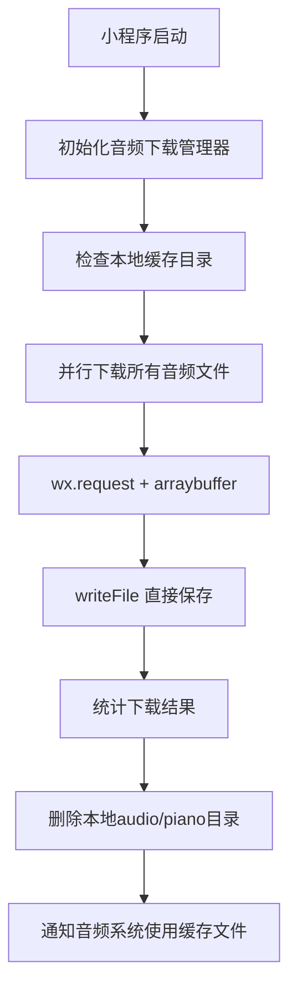

# 🎵 音频远程下载系统指南

## 📋 更新概览

本次更新实现了从云端下载钢琴音频文件的功能，使音频文件的管理更加灵活和高效。

### ✅ 主要改进

1. **音频远程下载**: 从云端URL自动下载88键钢琴音频文件
2. **本地缓存管理**: 智能缓存到用户数据目录，避免重复下载
3. **自动清理**: 下载完成后自动删除本地`audio/piano`目录
4. **优雅降级**: 下载失败时自动回退到本地文件或振动反馈
5. **🆕 稳定下载**: 参考五线谱下载方法，使用更稳定的 `wx.request` + `arraybuffer` 方案

## 🔧 修复说明

### 原问题
- 使用 `wx.downloadFile` 在某些环境下不稳定
- Promise 处理方式有缺陷
- 文件保存逻辑不够健壮

### 解决方案
参考成熟的五线谱图片下载管理器，采用以下改进：

1. **下载方式改进**:
```javascript
// 旧方式：wx.downloadFile + saveFile
wx.downloadFile({ url, success, fail })

// 新方式：wx.request + arraybuffer + writeFile
wx.request({
  url,
  responseType: 'arraybuffer',
  success: (res) => {
    wx.getFileSystemManager().writeFile({
      filePath: localPath,
      data: res.data,
      success, fail
    })
  }
})
```

2. **Promise 处理优化**:
```javascript
// 旧方式：复杂的超时和状态检查
// 新方式：标准 Promise + allSettled 处理
const results = await Promise.allSettled(downloadPromises)
```

3. **错误处理增强**:
```javascript
// 详细的错误统计和日志
console.error(`❌ 音频下载失败详情:`)
console.error(`   文件名: ${config.fileName}`)
console.error(`   下载地址: ${config.remoteUrl}`)
console.error(`   错误信息:`, result.reason)
```

## 🚀 新增文件

### 1. 音频下载管理器 (`utils/audioDownloadManager.js`)
```javascript
// 核心功能
- 从云端下载88个钢琴音频文件 (A0-C8)
- 智能缓存到 wx.env.USER_DATA_PATH/audio/piano/
- 使用稳定的 wx.request + arraybuffer 下载方案
- 详细的错误统计和重试机制
```

### 2. 更新的音频工具类 (`utils/audioUtils.js`)
```javascript
// 新增功能
- 优先使用下载的音频文件
- 自动回退到本地资源
- 集成音频下载管理器
```

### 3. 更新的应用初始化 (`app.js`)
```javascript
// 并行初始化
- 同时初始化图片和音频下载
- 音频下载状态管理
- 自动清理本地audio/piano目录
```

## 🔧 技术实现

### 云端音频URL结构
```
基础URL: https://music-1253799806.cos.ap-guangzhou.myqcloud.com/audio/piano/
音频文件: {noteKey}.mp3 (如: c4.mp3, g#5.mp3)
总文件数: 88个 (A0到C8)
总大小: 约2MB
```

### 下载流程


### 缓存目录结构
```
wx.env.USER_DATA_PATH/
└── audio/
    └── piano/
        ├── a0.mp3
        ├── a#0.mp3
        ├── b0.mp3
        ├── c1.mp3
        ├── ...
        └── c8.mp3
```

## 🎹 使用方法

### 自动初始化
小程序启动时会自动开始下载音频文件，无需手动操作。

### 状态监控
```javascript
// 在页面中检查下载状态
const app = getApp()
const audioStatus = app.globalData.audioDownloadStatus

console.log('下载进度:', audioStatus.progress + '%')
console.log('是否完成:', audioStatus.isCompleted)
console.log('是否有错误:', audioStatus.error)
```

### 音频播放
```javascript
// 音频系统会自动选择最佳音源
audioManager.playNote('c4') // 优先使用下载的文件
```

## 📊 性能优化

### 下载策略
- **并行下载**: 使用 Promise.allSettled 并行下载所有文件
- **稳定传输**: wx.request + arraybuffer 确保数据完整性
- **超时处理**: 30秒超时，避免长时间等待
- **详细统计**: 成功/失败计数和详细错误信息

### 存储优化
- **智能缓存**: 检查已存在文件，避免重复下载
- **空间回收**: 删除冗余的本地文件
- **用户数据**: 存储在用户数据目录，不占用代码包空间

## 🔍 调试信息

### 控制台日志
```
🚀 开始初始化音频管理器...
🌐 基础URL: https://music-1253799806.cos.ap-guangzhou.myqcloud.com/audio/piano/
📁 本地缓存目录: /var/mobile/Containers/.../Documents/audio/piano/
🎵 生成音频配置: 88 个音频文件
🚀 开始下载 88 个音频文件...
⏬ 开始下载音频: c4.mp3
🔄 使用request方法下载: c4.mp3
📦 获取到音频二进制数据，大小: 45678 字节
✅ request方法保存成功: c4.mp3
...
📊 音频下载完成统计:
   ✅ 成功: 88 个
   ❌ 失败: 0 个
   📈 成功率: 100%
🎉 音频管理器初始化完成
```

### 音频URL优选日志
```
查询音频: c4, 下载状态: success, 路径: /var/mobile/.../audio/piano/c4.mp3
使用下载的音频文件: c4 -> /var/mobile/.../audio/piano/c4.mp3
使用本地资源文件: c4  (回退模式)
```

## 🚨 故障排除

### 常见问题

1. **下载失败**
   - 检查网络连接
   - 查看详细的错误统计日志
   - 音频系统会自动回退到本地文件

2. **本地文件删除失败**
   - 不影响程序运行
   - 只会记录警告信息
   - 缓存的音频文件仍可正常使用

3. **音频播放异常**
   - 系统会自动尝试本地资源
   - 最终回退到振动反馈
   - 用户体验不受影响

### 手动重置
```javascript
// 如需重新下载所有文件
const audioDownloadManager = app.getAudioDownloadManager()
await audioDownloadManager.clearCache()
await audioDownloadManager.forceReinitialize()
```

## 🎯 优势总结

### 用户体验
- ✅ 高质量音频文件自动下载
- ✅ 无感知的后台处理
- ✅ 优雅降级确保稳定性
- ✅ 减少代码包大小

### 开发体验
- ✅ 音频资源云端管理
- ✅ 本地缓存加速访问
- ✅ 智能回退机制
- ✅ 详细的调试信息

### 维护便利
- ✅ 音频文件集中存储
- ✅ 版本更新无需重新打包
- ✅ 支持热更新音频资源
- ✅ 减少本地存储需求

### 🆕 技术改进
- ✅ 参考成熟的图片下载方案
- ✅ 使用更稳定的 wx.request + arraybuffer
- ✅ Promise.allSettled 并行处理
- ✅ 详细的错误统计和日志

## 🔮 未来扩展

1. **音频质量选择**: 根据网络状况选择不同音质
2. **增量更新**: 只下载有更新的音频文件
3. **压缩算法**: 使用更高效的音频压缩格式
4. **CDN加速**: 部署到更多地区加速下载

---

**总结**: 这次更新修复了音频下载的稳定性问题，参考成熟的五线谱图片下载方案，让您的音乐学习小程序拥有了专业级的音频管理系统。用户可以享受到高质量的钢琴音效，同时开发者也获得了更稳定可靠的资源管理方式。🎹✨ 