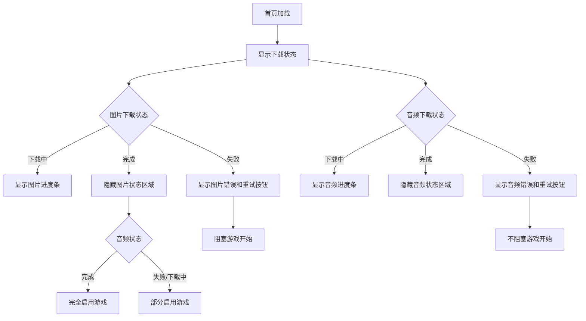

# 🎵 首页音频下载提示功能说明

## 📋 功能概览

为首页添加了音频下载状态提示功能，与现有的五线谱图片下载提示保持一致的用户体验。

## ✅ 新增功能

### 1. 音频下载状态显示
- **下载进度条**: 实时显示88个钢琴音频文件的下载进度
- **状态图标**: 使用 🎵 图标标识音频下载状态
- **进度百分比**: 显示具体的下载完成百分比

### 2. 音频下载错误处理
- **错误提示**: 显示具体的下载失败原因
- **友好说明**: 提示用户音频失败不影响学习，会使用振动反馈
- **重试功能**: 提供"重新下载音频"按钮，支持手动重试

### 3. 下载状态提示区域
- **必要性区分**: 明确标识五线谱图片为必需，音频为可选
- **状态说明**: 
  - 📊 需要五线谱图片才能开始学习
  - 🎵 音频可选，失败时使用振动反馈

### 4. 游戏开始逻辑优化
- **阻塞条件**: 五线谱图片未下载完成时阻塞游戏开始
- **非阻塞提示**: 音频下载失败时给出提示但不阻塞游戏

## 🔧 技术实现

### 页面数据结构
```javascript
data: {
  // 图片下载状态
  imageDownloadStatus: {
    isDownloading: true,
    isCompleted: false,
    progress: 0,
    error: null
  },
  // 音频下载状态 (新增)
  audioDownloadStatus: {
    isDownloading: true,
    isCompleted: false,
    progress: 0,
    error: null
  }
}
```

### 下载完成回调
```javascript
// 图片下载完成回调
onImageDownloadComplete(status) {
  // 处理五线谱图片下载完成
}

// 音频下载完成回调 (新增)
onAudioDownloadComplete(status) {
  // 处理钢琴音频下载完成
}
```

### 进度轮询优化
```javascript
startProgressPolling() {
  const timer = setInterval(() => {
    // 同时获取图片和音频下载进度
    const imageProgress = app.getImageDownloadProgress()
    const audioProgress = app.getAudioDownloadProgress()
    
    // 更新页面数据
    this.setData({
      'imageDownloadStatus.progress': imageProgress.percentage,
      'audioDownloadStatus.progress': audioProgress.percentage
    })
    
    // 都下载完成时停止轮询
    if (!app.globalData.imageDownloadStatus.isDownloading && 
        !app.globalData.audioDownloadStatus.isDownloading) {
      clearInterval(timer)
    }
  }, 1000)
}
```

### 重试功能
```javascript
// 图片重新下载
async retryImageDownload() {
  await app.initializeImages()
}

// 音频重新下载 (新增)
async retryAudioDownload() {
  await app.initializeAudio()
}
```

## 🎨 界面设计

### 下载状态区域
- **渐变背景**: 使用半透明背景和毛玻璃效果
- **动画效果**: 下载图标带有弹跳动画
- **进度条**: 绿色渐变进度条，平滑过渡

### 错误状态显示
- **图片错误**: ⚠️ 图标 + 红色文字
- **音频错误**: 🔇 图标 + 红色文字 + 橙色说明

### 状态提示区域
```css
.download-hint {
  background: rgba(255, 193, 7, 0.1);
  border: 1rpx solid rgba(255, 193, 7, 0.3);
  border-radius: 16rpx;
  backdrop-filter: blur(5px);
}
```

## 📱 用户体验

### 1. 初始状态
用户打开首页时看到：
- 📊 正在加载五线谱图片... (进度条)
- 🎵 正在加载钢琴音频... (进度条)

### 2. 下载中状态
- 实时更新的进度百分比
- 动画图标提供视觉反馈
- 模式选择按钮处于禁用状态

### 3. 部分完成状态
- 五线谱完成，音频仍在下载：可以开始游戏
- 五线谱失败：阻塞游戏，提供重试按钮
- 音频失败：不阻塞游戏，提示使用振动反馈

### 4. 全部完成状态
- 隐藏下载状态区域
- 启用所有交互功能
- 显示"开始学习"按钮

## 🔄 状态流转



## 🎯 优势总结

### 用户体验
- ✅ 清晰的下载状态反馈
- ✅ 区分必需和可选资源
- ✅ 优雅的错误处理
- ✅ 一致的视觉设计

### 功能特性
- ✅ 并行下载状态监控
- ✅ 智能游戏开始逻辑
- ✅ 便捷的重试机制
- ✅ 详细的状态提示

### 技术实现
- ✅ 模块化的状态管理
- ✅ 统一的回调机制
- ✅ 高效的轮询策略
- ✅ 响应式UI更新

---

**总结**: 这次更新让首页拥有了完整的资源下载状态提示系统，用户可以清楚地了解五线谱图片和钢琴音频的下载进度，并在出现问题时获得及时的反馈和解决方案。🎵✨ 